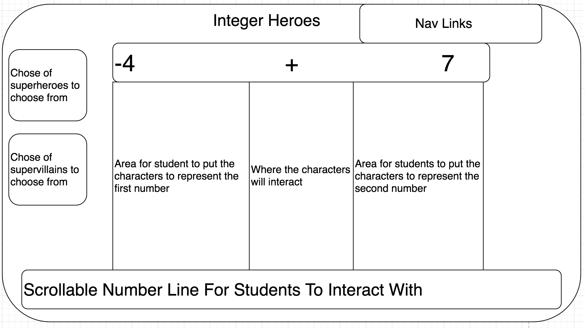

## Integer Heroes

### Background

Integer Heroes is a math game for late primary to early middle school students. It provides students with a visual representation of integer addition and subtraction so that they can develop a stronger conceptual understanding.

In Integer Heroes, students are first given an integer operation problem (ie. 5 + (-9)= ?). Then, they have to decide the appropriate way to represent each of the numbers in the problem. In this game, superheroes represent positive numbers, and supervillains represent negative numbers. In the case of 5 + (-9), the students would select 5 heroes to represent the positive five, and 9 villains to represent the negative nine.

Next, they have to make a decision on what happens when the different characters "meet" each other. In the case of 5 + (-9), 5 of the superheroes cancel out 5 of the supervillains, which leaves four supervillains left for an answer of -4.

One key concept that students also have to learn at this age is understanding multiple representation of the same problems. With this in mind, the design of this game will include a scrollable number line at the bottom of the page that will concurrently represent the scenario that is being played out by the student on top with the heroes and villains.

The game will have multiple levels for the students. The second level will be a flipped version of level one, where students have to choose the correct numbers to represent the superheroes and supervillains that are displayed. The third and fourth level will deal with subtraction, and the fifth level will be a mix of both types of problems.

### Functionality & MVP  

In this game, students will be able to:

- [ ] Select the correct superhero/villain representation of integers
- [ ] Determine what happens to the characters when they meet and what the    correct outcome would be.
- [ ] Manipulate the number line to correctly match the math problem.
- [ ] Advance through different levels to expand their conceptual knowledge of integer operations

In addition, this project will include:

- [ ] An About modal briefly explaining how to interact with the game
- [ ] A production Readme

### Wireframes

This app will consist of a single screen that is divided into two subsections (the area with the heroes/villains, and the area with the number line), as well as nav links to the Github, my LinkedIn, and the About modal. Students will be able to choose between three different heroes to drag on to the screen, and three different villains to drag on to the screen to represent the math problem. Then, pop ups will come up asking them to make a decision on what they believe will happen when the characters meet, as well as to provide an answer on what the outcome would be.

### Architecture and Technologies

This project will be implemented with the following technologies:

- Vanilla JavaScript and `jquery` for overall structure and game logic,
- `Easel.js` with `HTML5 Canvas` for DOM manipulation, sprites animation, and rendering,
- Webpack to bundle and serve up the various scripts.
- Some sort of library to help with the dragging of the characters across the screen.

In addition to the webpack entry file, there will be three scripts involved in this project:

`board.js`: this script will handle the logic for creating and updating the necessary `Easel.js` elements and rendering them to the DOM.

`automata.js`: this script will handle the logic behind the scenes.  An Automata object will hold a `type` (hexagon, triangle, or square) and a 2D array of `Cell`s.  It will be responsible for doing neighbor checks for each `Cell` upon iteration and updating the `Cell` array appropriately.

`cell.js`: this lightweight script will house the constructor and update functions for the `Cell` objects.  Each `Cell` will contain a `type` (hexagon, triangle, or square) and an `aliveState` (`true` or `false`).

### Implementation Timeline

**Day 1**: Setup all necessary Node modules, including getting webpack up and running and `Easel.js` installed.  Create `webpack.config.js` as well as `package.json`.  Write a basic entry file and the bare bones of all 3 scripts outlined above.  Learn the basics of `Easel.js`.  Goals for the day:

- Get a green bundle with `webpack`
- Learn enough `Easel.js` to render an object to the `Canvas` element

**Day 2**: Dedicate this day to learning the `Easel.js` API.  First, build out the `Cell` object to connect to the `Board` object.  Then, use `board.js` to create and render at least the square grid, ideally all 3 grid types.  Build in the ability to toggle the live/dead states on click for each cell.  Goals for the day:

- Complete the `cell.js` module (constructor, update functions)
- Render a square grid to the `Canvas` using `Easel.js`
- Make each cell in the grid clickable, toggling the state of the square on click
- Do the same for triangular and hexagonal grids

**Day 3**: Create the automata logic backend.  Build out modular functions for handling the different grid types along with their unique neighbor checks and rule sets.  Incorporate the automata logic into the `Board.js` rendering.  Goals for the day:

- Export an `Automata` object with correct type and handling logic
- Have a functional grid on the `Canvas` frontend that correctly handles iterations from one generation of the game to the next

**Day 4**: Install the controls for the user to interact with the game.  Style the frontend, making it polished and professional.  Goals for the day:

- Create controls for game speed, stop, start, reset, and shape type
- Have a styled `Canvas`, nice looking controls and title
- If time: include buttons on the side to toggle the color scheme of the cells

### Bonus features

If the MVP is finished ahead of schedule, some potential bonus features include:

- [ ] Expanding this game to also provide visual representations of integer multiplication and division
- [ ] Ability to toggle between a horizontal and vertical number line
- [ ] Letting students choose how many integers per problem to work with
